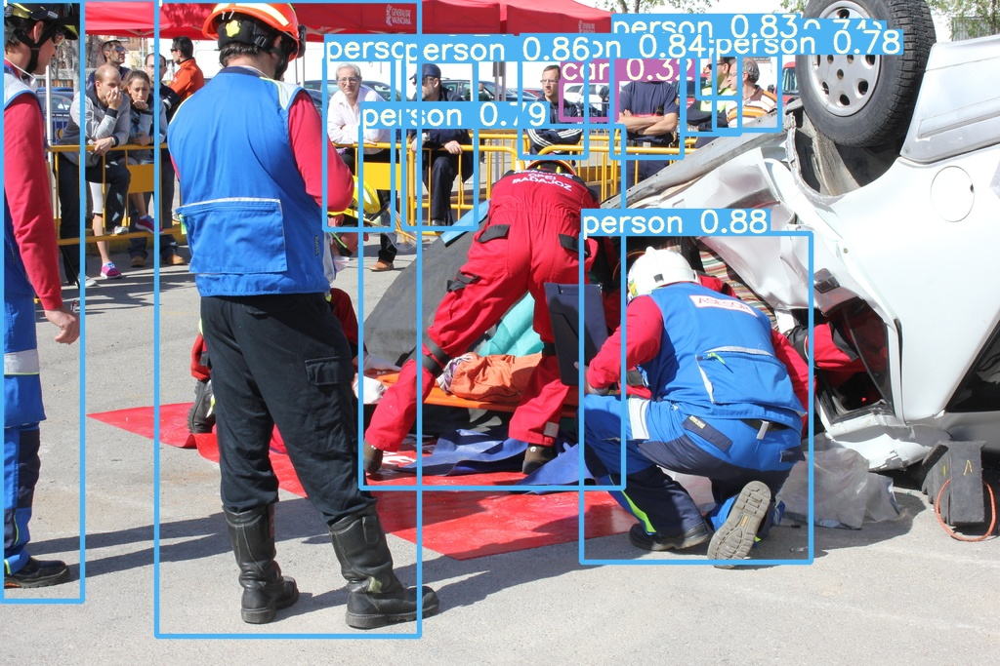
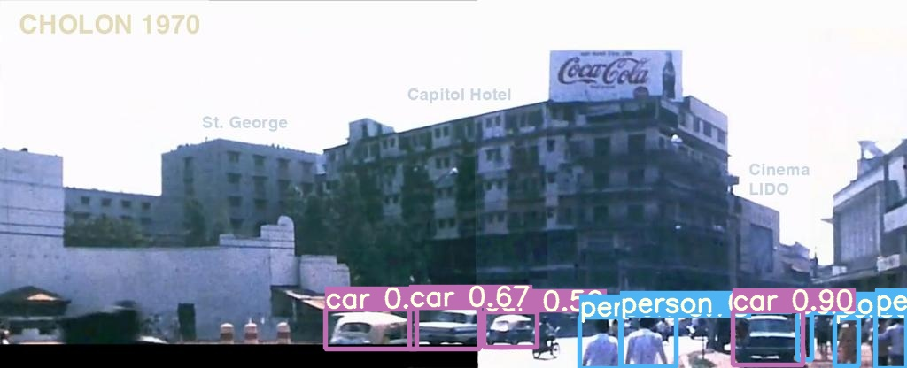
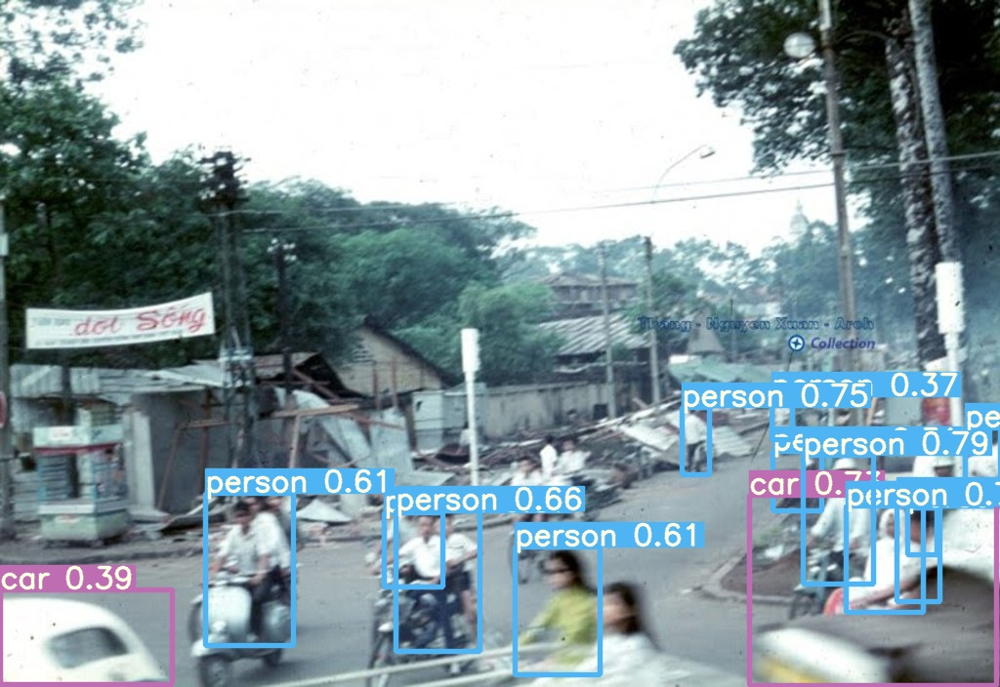

# Popular Object Detection API's
Try popular API's explores different architectures and libraries like
 - Detectron 2  (Facebook)
- Tensorflow object detection API ( TF 1.*)  (google)
 -  YOLO ( V5 ?) :-) (ultralytics)

# DATA
The data is been collected from open images which consist of Two labels CAR & PERSON classes
which consists of 2239 images .
Labels are in COCO format and detaliled data analysis you can find in  data-analysis-augmentation.ipynb
and Test and Train split in data folder.

# Augmentation
Augmentation plays very important role in any computer vision problem. where we can generate additional 
training images which can take care different scenarios.
I have used albumentations api which has handy API to generate different images and can retrurn new bboxes.
detail implementation you can find in data-analysis-augmentation.ipynb notebook.

```sh
transform = A.Compose(
    [A.HorizontalFlip(p=1),
     A.OneOf([
        A.HueSaturationValue(),
        A.RandomBrightnessContrast(p=0.7),
        A.RGBShift(r_shift_limit=30, g_shift_limit=30, b_shift_limit=30, p=0.3),
    ])
    
    ],
    bbox_params=A.BboxParams(format='coco', label_fields=['category_ids']),
)
# Returns 
transformed['image'],
transformed['bboxes'],
transformed['category_ids']
```
NOTE:  only augmentated Training set!

# Results :
Here are few Results of different architectures and libraries

| Architecture/Lib | AP50 |
| ------ | ------ |
| FRCNN / Tensorflow | 62.1 ** |
| FRCNN / Detectron 2 | 74.18 |
| YoloV5m / ultralytics  | 63.0 |

**Note: Tensorflow API only Trained for 2 epochs.

The Detailed of model Training You can find in respective directories 

# Sample Predections




