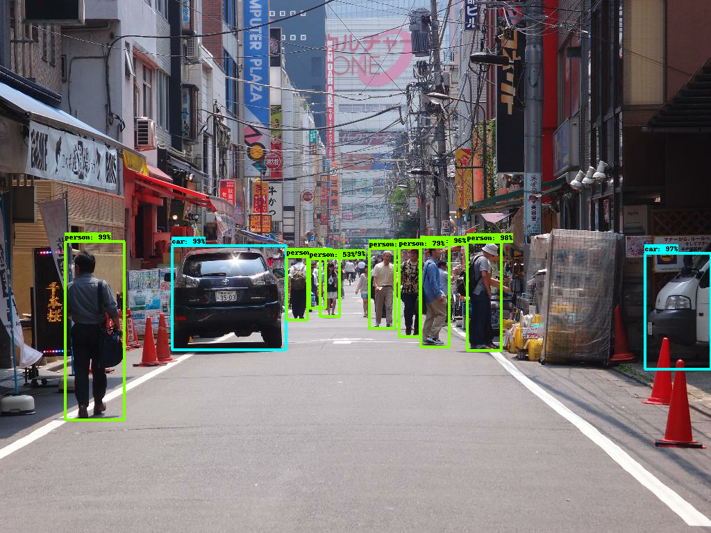

# Tensorflow Object Detection API
The model is trained on FRCNN arch and Weights is been used from https://github.com/tensorflow/models/blob/master/research/object_detection/g3doc/tf1_detection_zoo.md .


# Trainaing & DATA 
The model docker i published in docker hub and anyone can use it to run in any GPU machines. 
https://hub.docker.com/repository/docker/rickragvdocker/tensorflow-object-detection-gpu

Tensorflow API requires Tfrecord formats to train there API, so you have to create seperate train
and test tfrecords and configure the path in config

```sh
docker run --runtime=nvidia \
 -e NVIDIA_VISIBLE_DEVICES=0 \ 
 -e PIPELINE_CONFIG=*.config \  
 -e NUM_CLONES=1 \  
 -it -p 8080:8080 \
 --mount type=bind,source={source_path},target=/root/models/research/training \
 rickragvdocker/tensorflow-object-detection-gpu 
```

