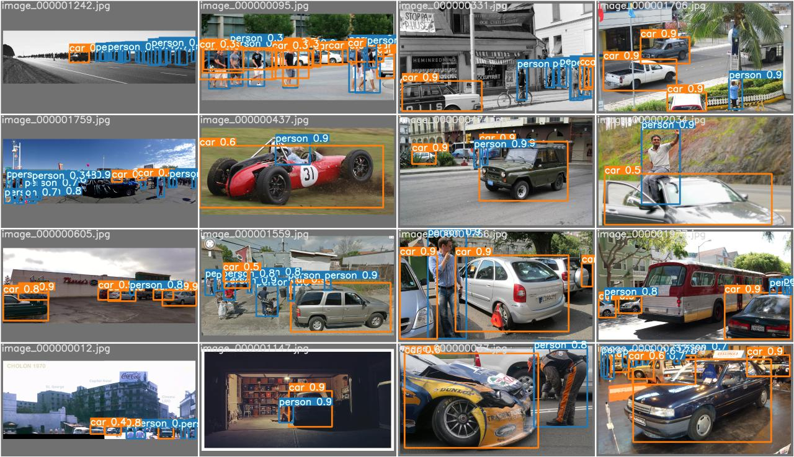

# YOLO V5 ? 
There is open debate whether there is V5 or not but at the time of training  i found the API
easy to use and IT WORKS! The details you can find here https://github.com/ultralytics/yolov5
I have used there yolov5m model to train

# Trainaing
The Details of Data creation and Training is found in notebook. and for further informations you can check there's page  
https://github.com/ultralytics/yolov5/wiki/Train-Custom-Data

```sh
python train.py --img 1024 --batch 20 --epoch 30 --data person.yaml --cfg yolov5m.yaml --weights yolov5m.pt --name person 
```



